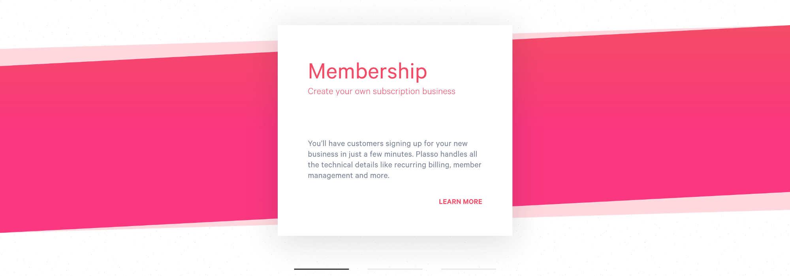

On my journey to becoming a Full Stack Web Developer, I’ve begun cloning the Plasso homepage as my first real project. Despite thinking the slider is “kiddy stuff”, I posted a story on Instagram showing it. Mentioning I used nothing but HTML and CSS, a handful of people asked how they could do it too. That’s when I realised, it may seem like a novice task but a lot of people can still benefit from reading the code, and beginners could benefit from a walkthrough.

## Lets Get Started

### Background Markup

Firstly, to keep things organised and semantic, everything related to the slider is contained in `section.slider`. It contains the backgrounds, slides and paginations.

```pug
.slider__backgrounds.slider__backgrounds__bottom.slider__backgrounds__bottom--membership
.slider__backgrounds.slider__backgrounds__bottom.slider__backgrounds__bottom--billing
.slider__backgrounds.slider__backgrounds__bottom.slider__backgrounds__bottom--storefront
.slider__backgrounds.slider__backgrounds__top.slider__backgrounds__top--membership
.slider__backgrounds.slider__backgrounds__top.slider__backgrounds__top--billing
.slider__backgrounds.slider__backgrounds__top.slider__backgrounds__top--storefront
```

You can’t use transition on a background that contains a gradient. For example, this won't work:

```sass
.a-div
    background: linear-gradient(red, blue 50%)

.a-div:hover
    background: linear-gradient(blue, red 50%)
```

However, this will:

```sass
.a-div
    background-color: blue
.a-div:hover
    background-color: red
```

For that reason, we need a background for each slider. This could’ve been approached in three ways:

1.  Use linear-gradient() to create a solid block of color, a gradient, another solid block of color, then skewY().
2.  Make two backgrounds for each slide, one with the solid block of color, another with the gradient. Apply skewY() to both.
3.  Same as number two, but instead of using skewY(), use polygon().

For all three solutions, we need to apply a fade out `transition` on `opacity`, while applying a fade in `transition` to the incoming slides background. This has the added benefit of improving performance by avoiding the [paint process](https://developers.google.com/web/fundamentals/performance/rendering/).

Solution one below creates jagged edges, for which I couldn’t find a solution.


We’re left with solutions two and three. I went with solution three based on my own preference.

### Background Styling

```sass
.slider
  position: relative
  width: 100%
  margin: 50px 0

  &__backgrounds
    position: absolute
    height: 380px
    width: 100%
    opacity: 0
    transition: opacity 1s linear
    will-change: opacity

    &__bottom
      clip-path: polygon(0 11.4%, 100% 0%, 100% 88.9%, 0% 100%)

      &--membership
        background-color:  #ffd9df

      &--billing
        background-color: #c8f0da

      &--storefront
        background-color: #d8e9ff

    &__top
      clip-path: polygon(0 19.7%, 100% 0%, 100% 80.3%, 0% 100%)

      &--membership
        background: linear-gradient(#f44c67, #fb377f 50%)

      &--billing
        background: linear-gradient(#3cd781, #21b88f 50%)

      &--storefront
        background: linear-gradient(#6472ff, #4a42e6 50%)
```

We want all the `.slider__backgrounds` classes to be positioned the same. If we were to not position `.slider`, we'd need to relative position all `.slider__background` divs and then use `top: -100%` for the second `.slider__backgrounds`, `then top: -200%` for the next and so on. Using `absolute` avoids all those extra lines of code and places the backgrounds exactly where we need them using a single line of code.

Since all the divs are empty (in terms of HTML elements) and all the `.slider__background` divs will remain empty, a height and width is added to give them some life.

To get the required shape for `.slider__backgrounds__bottom` and `.slider__backgrounds__top`, `polygon()` from solution three is used.

The modifier classes for `.backgrounds__slider__bottom` and .`backgrounds__slider__top` come in handy for easily applying the different backgrounds, as well making it easy to read and understand the CSS.

### Slides Markup and Layout

```pug
.slider__slides
  .slider__slides__slide
    h3.slider__slides__slide__title.slider__slides__slide__title--membership Membership
    h4.slider__slides__slide__sub-title.slider__slides__slide__sub-title--membership Create your own subscription business
    p.slider__slides__slide__text.slider__slides__slide__text--membership You’ll have customers signing up for your new business in just a few minutes. Plasso handles all the technical details like recurring billing, member management and more.
    a.slider__slides__slide__link.slider__slides__slide__link--membership(href="#") Learn More
  .slider__slides__slide
    h3.slider__slides__slide__title.slider__slides__slide__title--billing Billing
    h4.slider__slides__slide__sub-title.slider__slides__slide__sub-title--billing Create your own subscription business
    p.slider__slides__slide__text.slider__slides__slide__text--billing You’ll have customers signing up for your new business in just a few minutes. Plasso handles all the technical details like recurring billing, member management and more.
    a.slider__slides__slide__link.slider__slides__slide__link--billing(href="#") Learn More
  .slider__slides__slide
    h3.slider__slides__slide__title.slider__slides__slide__title--storefront Storefront
    h4.slider__slides__slide__sub-title.slider__slides__slide__sub-title--storefront Create your own subscription business
    p.slider__slides__slide__text.slider__slides__slide__text--storefront You’ll have customers signing up for your new business in just a few minutes. Plasso handles all the technical details like recurring billing, member management and more.
    a.slider__slides__slide__link(href="#") Learn More
```

```sass
&__slides
  height: 380px
  display: grid
  grid-template-columns: 100% 100% 100%
  transition: transform 1s ease-in-out
  will-change: transform
```

As all the divs above `.slider__slides` are absolute positioned, it is positioned exactly where we need it to be. This is because the aforementioned divs are taken out of the normal flow.

Using `display: grid`, the basic structure of each slide is complete in two lines. This causes an overflow as `.slider__slides` now has a layout of three columns that are 300% wide combined. If you apply `overflow: hidden` to `.slider__slides`, it solves the problem, almost. There won’t be an overflow, but the drop shadow on the `.slider__slides_slide` will be cut off on the top. The solution to this was to `add overflow: hidden` to the parent div of `.slider__slides`, which in this case is body.

I used `will-change` to aid in smoother framerates.

> The will-change CSS property provides a way for authors to hint browsers about the kind of changes to be expected on an element, so that the browser can set up appropriate optimizations ahead of time before the element is actually changed. These kind of optimizations can increase the responsiveness of a page by doing potentially expensive work ahead of time before they are actually required.  —  MDN

## Making It All Work

### Pagination, Labels and Inputs

This is the moment you’ve been waiting for. So how does it actually slide on a click?

```pug
.slider__pagination
    label.slider__pagination__section.slider__pagination__section--membership#membershipSection(for="membershipSlide") Membership
    label.slider__pagination__section.slider__pagination__section--billing#billingSection(for="billingSlide") Billing
    label.slider__pagination__section#storefrontSection.slider__pagination__section--storefront(for="storefrontSlide") Storefront
```

```pug
section.slider
  input(type="radio", name="pagination" id="membershipSlide", checked="true")
  input(type="radio", name="pagination" id="billingSlide")
  input(type="radio", name="pagination" id="storefrontSlide")
```

The pagination sections are actually labels, which are linked to radio inputs. Therefore, when you click on a label, the corresponding radio input is selected, deselecting the others. This avoids writing JavaScript logic to see what slide is currently active, removing the ‘activation’ class, then seeing which slide the user chose and ‘activating’ it.

```sass
#membershipSlide,
#billingSlide,
#storefrontSlide
  display: none

#membershipSlide:checked
  ~ .slider__backgrounds__top--membership,
  ~ .slider__backgrounds__bottom--membership
    opacity: 1
  ~ .slider__slides
    transform: translateX(0%)
  ~ .slider__pagination .slider__pagination__section--membership
    opacity: 1

#billingSlide:checked
  ~ .slider__backgrounds__top--billing,
  ~ .slider__backgrounds__bottom--billing
    opacity: 1
  ~ .slider__slides
    transform: translateX(-100%)
  ~ .slider__pagination .slider__pagination__section--billing
    opacity: 1

#storefrontSlide:checked
  ~ .slider__backgrounds__top--storefront,
  ~ .slider__backgrounds__bottom--storefront
    opacity: 1
  ~ .slider__slides
    transform: translate(-200%)
  ~ .slider__pagination .slider__pagination__section--storefront
    opacity: 1
```

Using `:checked` is the other half. We’re all familiar with `:hover`, it’s the same concept. When the condition is true, the CSS is applied. However, there’s one caveat. You need to use a **general**, **child** or **adjacent combinator**. If you remove the `~`, the slider won’t work at all.

After that, it’s just a matter of adding the transitions and you’re done.

Here’s the [codepen](https://codepen.io/ibrahimbutt/pen/goWxJX) if you want to see all of the code.

## Conclusion

It’s that simple. Now I’m sitting here thinking, “does this really deserve a whole article? Is this even helpful?”. Tweet or email me to let me know. The same applies if you have any questions.
