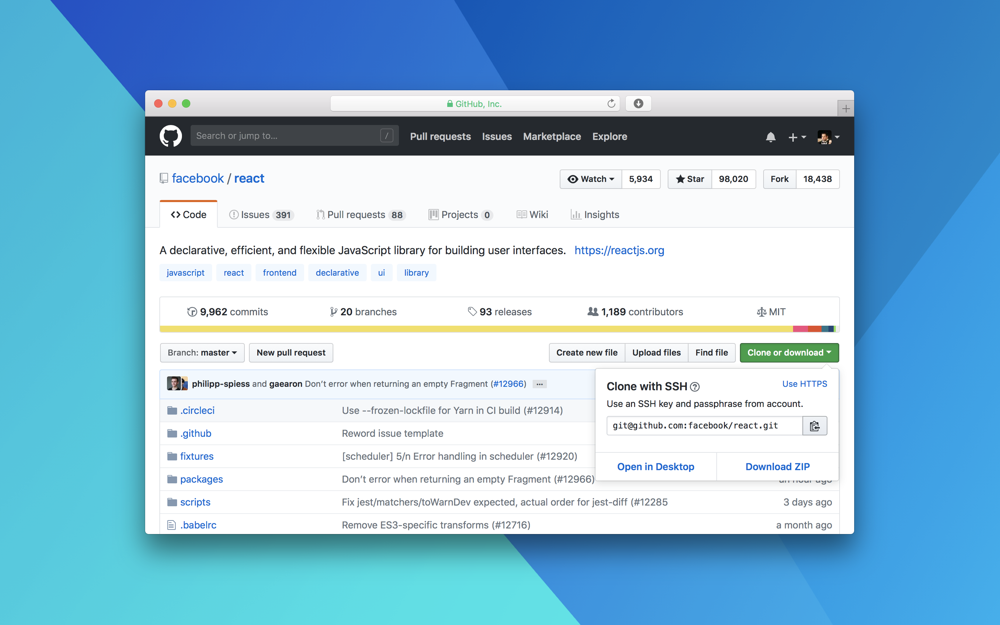

**The aim of this post is to get you up to speed on using Git and GitHub in a team setting, wether you are new to using git as a whole or not. We'll start form the basics of using git, to pulls requests, merge requests and rebase. Then onto using GitHub projects, issues and milestones.**

I'll be assuming you know your way around a command line, at the very least being able to get in and out of directories.

## Basics

### Cloning a repository

> Cloning a repository downloads it to your computer.

Go to the page of the repository on GitHub. You'll see a green button which says 'Clone or download'. Use the SSH approach and click the little clipboard to save the string. In your terminal, go to the directory where you want to store the repository and type `git clone` then paste in the string from GitHub right after, then hit enter. Example: `git clone git@github.com:facebook/react.git`.

If you know the username/organisation and the repository, you dont need to head to GitHub first. You can clone the repository using the SSH approach by just writing the string yourself as it's in a consistent format: `git clone git@github.com<USERNAME_OR_ORG_NAME>/<REPO_NAME>.git`.

### Branching

Never work on the master branch. The `master` branch should always be in a working condition, in other words, it should be production ready. Instead, there should be a `development` branch.
